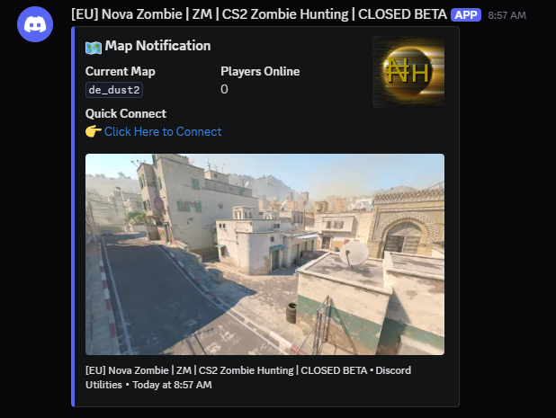
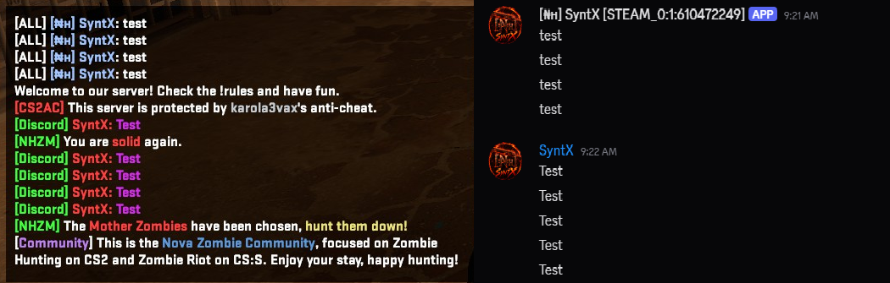
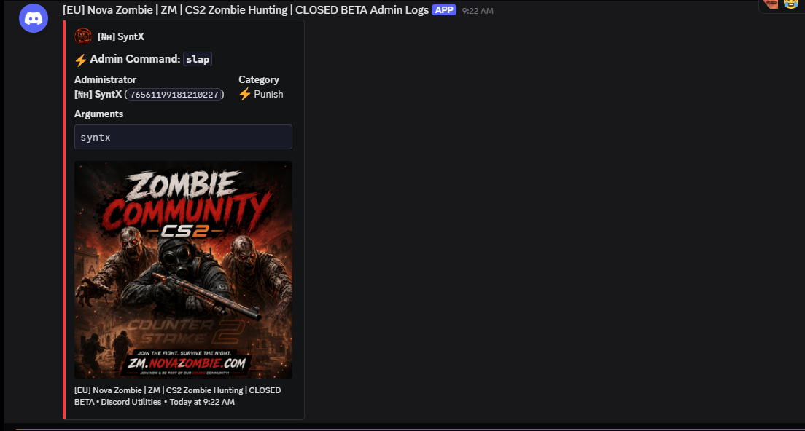
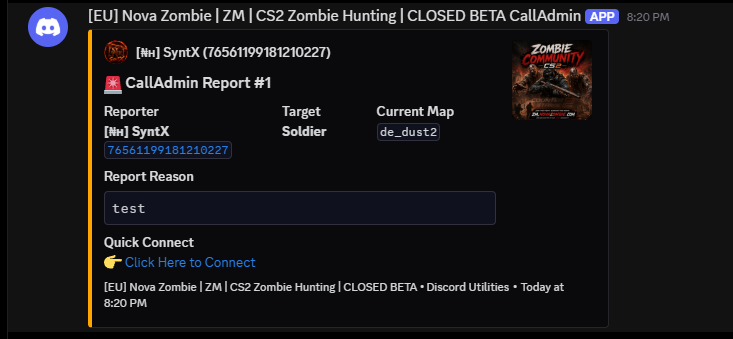
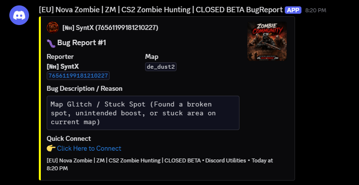

<div align="center">
  
  <h2><strong>Discord Utilities</strong></h2>
  <h3>Full-featured Discord integration plugin for Counter-Strike 2 servers running SwiftlyS2.</h3>
</div>

<p align="center">
  <a href="https://github.com/SyntX34/CS2-SwiftlyS2-DiscordUtilities/releases"></a>
  <a href="https://github.com/swiftly-solution/swiftlys2"></a>
  <a href="LICENSE"></a>
</p>

## Features

| Feature | Description | Webhook |
|---------|-------------|---------|
| 🗺️ **Map Notifications** | Rich embeds on map change — workshop detection, preview images from Steam API, player count, custom banners | Separate webhook |
| 💬 **Chat Relay** | Server chat → Discord with player Steam avatars, per-player cooldowns, command filtering | Separate webhook |
| 🔒 **Admin Logs** | Logs admin commands (ban/kick/mute/slap/map changes/cvar/rcon) with categorized embeds, ignores server console spam | Separate webhook |
| 🚨 **CallAdmin** | In-game player reporting (`!calladmin`, `!report`, `sw_calladmin`) to Discord with target detection, cooldowns, and role pings | Separate webhook |
| 🐛 **Bug Report** | In-game bug reporting menu (`!bug`, `!bugreport`) with customizable preconfigured reasons (`bug_reasons.jsonc`) & custom details | Separate webhook |
| 🔄 **Discord → Server** | *(Phase 2)* Relay Discord messages into the game server — requires bot token | Separate channel |

### Feature Previews

<details open>
<summary><b>🗺️ Map Change Notifications</b></summary>
<br>

Rich embed notification sent automatically whenever the server changes map. Automatically fetches and displays the official Steam Workshop thumbnail or fallback banner, along with server connection info, workshop ID, and player statistics.

<p align="center">
  <a href="readme/images/map_notification.png" target="_blank">
    
  </a>
</p>
</details>

<details open>
<summary><b>💬 In-Game Chat Relay</b></summary>
<br>

Live server chat relayed straight to Discord using player Steam profile avatars and formatted names. Features per-player cooldown protection and configurable command filtering to keep chat clean.

<p align="center">
  <a href="readme/images/relay.png" target="_blank">
    
  </a>
</p>
</details>

<details open>
<summary><b>🔒 Admin Action Logs</b></summary>
<br>

Comprehensive administrative logging that captures moderation actions (bans, kicks, mutes, slaps), map switching, ConVar modifications, and RCON executions with color-coded embed alerts and execution details.

<p align="center">
  <a href="readme/images/admin_logs.png" target="_blank">
    
  </a>
</p>
</details>

<details open>
<summary><b>🚨 CallAdmin & Player Reports</b></summary>
<br>

Allows players to call server administrators directly to Discord via `!calladmin` or `!report`. Features an interactive SwiftlyS2 in-game menu to select players and reasons (configured in `calladmin_reasons.jsonc`), cooldown limits, role mentions (`@here` / role IDs), and one-click direct connect links for admins.

<p align="center">
  <a href="readme/images/calladmin.png" target="_blank">
    
  </a>
</p>
</details>

<details open>
<summary><b>🐛 Bug & Issue Reporting</b></summary>
<br>

In-game reporting system via `!bug` or `!bugreport`. Players can choose from preconfigured bug categories (`bug_reasons.jsonc`) or submit custom issue descriptions with map information and player data dispatched straight to Discord.

<p align="center">
  <a href="readme/images/bugreport.png" target="_blank">
    
  </a>
</p>
</details>

## Requirements

- **SwiftlyS2** framework installed on your CS2 server
- **Steam Web API Key** — [Get one here](https://steamcommunity.com/dev/apikey) (for player avatars & workshop map images)
- **Discord Webhook URLs** — Create webhooks in your Discord server channel settings

## Installation

1. Download the latest release from [Releases](https://github.com/SyntX34/CS2-SwiftlyS2-DiscordUtilities/releases)
2. Extract into your server's `addons/swiftlys2/plugins/` directory
3. Start the server — `config.jsonc` will be auto-generated at:
   ```
   addons/swiftlys2/configs/plugins/DiscordUtilities/config.jsonc
   ```
4. Configure your webhook URLs and Steam API key in `config.jsonc`
5. Restart the server or hot-reload the plugin

## Configuration

The plugin uses **JSONC** (JSON with Comments) for configuration, auto-generated on first run. All settings support **hot-reload** — edit the file and changes apply immediately.

### Key Settings

```jsonc
{
  "DiscordUtilities": {
    // Steam Web API key (required for avatars & workshop images)
    "SteamApiKey": "YOUR_STEAM_API_KEY",
    // Server display name (leave empty to auto-detect from hostname convar)
    "ServerName": "",
    // Server IP:port (leave empty to auto-detect from ip + hostport convars)
    "ServerIP": "",
    // Override DNS / domain connect address (e.g. "zm.novazombie.com")
    "ServerDNS": "zm.novazombie.com",

    "MapNotification": {
      "Enabled": true,
      "WebhookUrl": "https://discord.com/api/webhooks/...",
      // Optional banner image URL (fallback if map has no workshop image)
      "BannerUrl": "",
      "EmbedColor": "#5865F2",
      "ShowWorkshopId": true,
      "ShowPlayerCount": true,
      "ShowServerIP": true,
      "CooldownSeconds": 10
    },

    "ChatRelay": {
      "Enabled": true,
      "WebhookUrl": "https://discord.com/api/webhooks/...",
      "BannerUrl": "",
      "UseSteamAvatars": true,
      "CooldownSeconds": 1,
      "IgnoreCommands": true,
      "IgnoreTeamChat": false
    },

    "AdminLogs": {
      "Enabled": true,
      "WebhookUrl": "https://discord.com/api/webhooks/...",
      // Optional banner image URL shown in admin log embeds
      "BannerUrl": "",
      "EmbedColor": "#ED4245",
      // Set to true to skip commands executed by server console/server scripts
      "IgnoreConsole": true,
      "LogCommands": true,
      "LogMapChanges": true,
      "LogCvarChanges": true,
      "LogRcon": true,
      "CooldownSeconds": 2
    },

    "CallAdmin": {
      "Enabled": true,
      "WebhookUrl": "https://discord.com/api/webhooks/...",
      // Mention admin role or user (e.g. "<@&ROLE_ID>" or "@here")
      "MentionRoleOrUser": "",
      "BannerUrl": "",
      "EmbedColor": "#FFA500",
      "CooldownSeconds": 30,
      "MinimumReasonLength": 3
    },

    "BugReport": {
      "Enabled": true,
      "WebhookUrl": "https://discord.com/api/webhooks/...",
      "MentionRoleOrUser": "",
      "BannerUrl": "",
      "EmbedColor": "#FFFF00",
      "MenuTitle": "Report a Bug / Issue",
      "CooldownSeconds": 30,
      "MinimumReasonLength": 3
    }
  }
}
```

### Per-Feature Webhooks

Each feature uses its own webhook URL, so you can route notifications to different Discord channels:

- `#map-updates` — Map notifications
- `#chat-log` — Chat relay
- `#admin-log` — Admin actions
- `#call-admin` — Player reports / CallAdmin alerts
- `#bug-reports` — Bug & issue reports


## Building

```bash
dotnet build
dotnet publish -c Release
```

The output will be in `build/publish/DiscordUtilities/` with a zip file at `build/DiscordUtilities.zip`.

## Credits

- Inspired by [Discord Utilities](https://github.com/NockyCZ/CS2-Discord-Utilities) for CounterStrikeSharp
- Built on the [SwiftlyS2](https://github.com/swiftly-solution/swiftlys2) framework