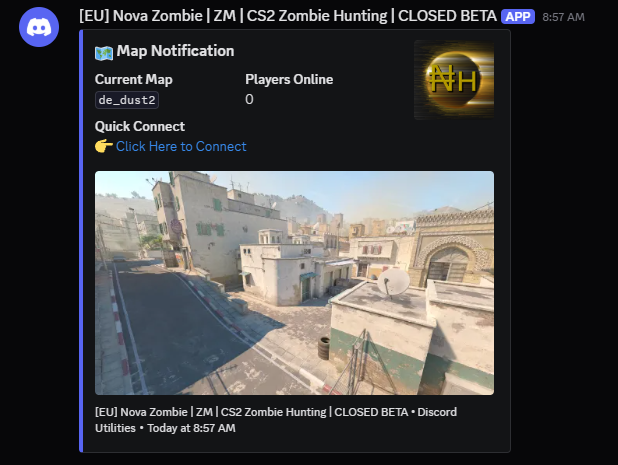
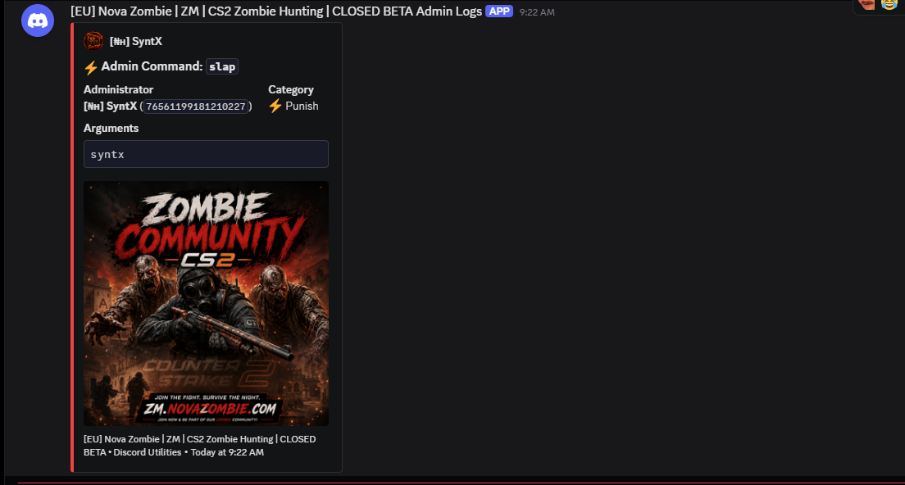
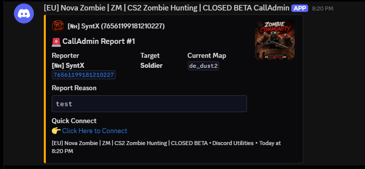

<div align="center">
  
  <h2><strong>Discord Utilities</strong></h2>
  <h3>Full-featured Discord integration plugin for Counter-Strike 2 servers running SwiftlyS2.</h3>
</div>

<p align="center">
  <a href="https://github.com/SyntX34/CS2-SwiftlyS2-DiscordUtilities/releases"></a>
  <a href="https://github.com/swiftly-solution/swiftlys2"></a>
  <a href="LICENSE"></a>
</p>

## Features

| Feature | Description | Webhook |
|---------|-------------|---------|
| 🗺️ **Map Notifications** | Rich embeds on map change — workshop detection, preview images from Steam API, player count, custom banners | Separate webhook |
| 💬 **Chat Relay** | Server chat → Discord with player Steam avatars, per-player cooldowns, command filtering | Separate webhook |
| 🔒 **Admin Logs** | Logs admin commands (ban/kick/mute/slap/map changes/cvar/rcon) with categorized Discord embeds and optional console filtering | Separate webhook |
| 🚨 **CallAdmin** | In-game player reporting (`!calladmin`, `!report`, `sw_calladmin`) to Discord with target detection, cooldowns, and role pings | Separate webhook |
| 🐛 **Bug Report** | In-game bug reporting menu (`!bug`, `!bugreport`) with customizable preconfigured reasons (`bug_reasons.jsonc`) & custom details | Separate webhook |
| 🔄 **Discord → Server** | Relay Discord channel messages into in-game chat — requires bot token and channel ID | Separate channel |
| 🔗 **Verification (Linking)** | Link Steam accounts to Discord via `!link` / `!verify` codes, with Discord role assignment, persistent links, and an interactive verification panel | Bot channel / Webhook |
| 🚫 **Command Blocker** | Block specified client commands until the player links their accounts and has the verified role | Separate webhook |
| 🖥️ **Discord RCON** | Execute server console commands (e.g. mute, gag, kick, ban) directly from Discord for authorized user IDs | Bot channel |

### Feature Previews

<details open>
<summary><b>🗺️ Map Change Notifications</b></summary>
<br>

One continuously updated Discord status message (30-second refresh by default) with the current map, player count, and connection details. Uses map artwork when available and falls back to the configured banner.

<p align="center">
  <a href="readme/images/map_notification.png" target="_blank">
    
  </a>
</p>
</details>

<details open>
<summary><b>💬 In-Game Chat Relay</b></summary>
<br>

Live server chat relayed straight to Discord using player Steam profile avatars and formatted names. Features per-player cooldown protection and configurable command filtering to keep chat clean.

<p align="center">
  <a href="readme/images/relay.png" target="_blank">
    
  </a>
</p>
</details>

<details open>
<summary><b>🔒 Admin Action Logs</b></summary>
<br>

Admin command logs with categorized Discord embeds, command details, and optional console filtering.

<p align="center">
  <a href="readme/images/admin_logs.png" target="_blank">
    
  </a>
</p>
</details>

<details open>
<summary><b>🚨 CallAdmin & Player Reports</b></summary>
<br>

Allows players to call server administrators directly to Discord via `!calladmin` or `!report`. Features an interactive SwiftlyS2 in-game menu to select players and reasons (configured in `calladmin_reasons.jsonc`), cooldown limits, role mentions (`@here` / role IDs), one-click server connection details, and a Handle button.

<p align="center">
  <a href="readme/images/calladmin.png" target="_blank">
    
  </a>
</p>
</details>

<details open>
<summary><b>🐛 Bug & Issue Reporting</b></summary>
<br>

In-game reporting system via `!bug` or `!bugreport`. Players can choose from preconfigured bug categories (`bug_reasons.jsonc`) or submit custom issue descriptions directly to Discord. Reports include a Handle button for staff.

<p align="center">
  <a href="readme/images/bugreport.png" target="_blank">
    
  </a>
</p>
</details>

## Requirements

- **SwiftlyS2** framework installed on your CS2 server
- **Steam Web API Key** — [Get one here](https://steamcommunity.com/dev/apikey) (for player avatars & workshop map images)
- **Discord Webhook URLs** — Create webhooks in your Discord server channel settings
- **Discord bot token** — Needed for Discord → Server, verification, and Discord RCON features
- **MySQL connection** — Configure SwiftlyS2 `mysql_detailed` for persistent Steam–Discord account links

## Installation

1. Download the latest release from [Releases](https://github.com/SyntX34/CS2-SwiftlyS2-DiscordUtilities/releases)
2. Extract into your server's `addons/swiftlys2/plugins/` directory
3. Start the server — `config.jsonc` will be auto-generated at:
   ```
   addons/swiftlys2/configs/plugins/DiscordUtilities/config.jsonc
   ```
4. Configure your webhook URLs and Steam API key in `config.jsonc`
5. Restart the server or hot-reload the plugin

## Configuration

The plugin uses **JSONC** (JSON with Comments) for configuration, auto-generated on first run. Some settings may require a plugin reload, particularly bot and verification settings.

### Configuration example

This example includes all settings from the current configuration model. Set webhook URLs, bot credentials, and IDs for the features you enable. The plugin also generates `config.jsonc` automatically on first start.

```jsonc
{
  "DiscordUtilities": {
    // Enable additional diagnostic logging.
    "Debug": false,
    // Steam Web API key (required for avatars & Workshop images).
    "SteamApiKey": "YOUR_STEAM_API_KEY",
    // Server display name (leave empty to auto-detect from hostname convar).
    "ServerName": "",
    // Server IP:port (leave empty to auto-detect from ip + hostport convars).
    "ServerIP": "",
    // Override DNS / domain connect address (e.g. "zm.novazombie.com").
    "ServerDNS": "zm.novazombie.com",
    // Keep one Discord server-status message updated at the configured interval.
    "MapNotification": {
      "Enabled": true,
      "WebhookUrl": "https://discord.com/api/webhooks/...",
      // Optional banner image URL (fallback if the map has no Workshop image).
      "BannerUrl": "",
      "EmbedColor": "#5865F2",
      "ShowWorkshopId": true,
      "ShowPlayerCount": true,
      "ShowServerIP": true,
      "CooldownSeconds": 10,
      // How often to refresh the existing Discord status message (seconds).
      "RefreshSeconds": 30
    },
    // Forward in-game chat messages to a Discord webhook.
    "ChatRelay": {
      "Enabled": true,
      "WebhookUrl": "",
      "UseSteamAvatars": true,
      // Player name format used by the chat relay.
      "UsernameFormat": "{PlayerName}",
      // Format for regular chat messages.
      "MessageFormat": "{Message}",
      // Format for team chat messages.
      "TeamMessageFormat": "(TEAM) {Message}",
      "CooldownSeconds": 1,
      "IgnoreCommands": true,
      // Message prefixes/commands excluded from chat relay.
      "IgnoredPrefixes": [
        "!",
        "/",
        "rtv",
        "nominate",
        "nextmap",
        "timeleft",
        "currentmap"
      ],
      "IgnoreTeamChat": false
    },
    // Forward messages from a Discord channel into in-game chat.
    "DiscordToServer": {
      "Enabled": false,
      "BotToken": "",
      "ChannelId": "",
      // Prefix shown in-game for messages coming from Discord.
      "ChatPrefix": "[Discord]",
      // Color of the Discord chat prefix in-game.
      "ChatColor": "#7289DA",
      // Template for Discord-to-server chat messages.
      "TagFormat": "{ChatPrefix} {DiscordName}: {Message}"
    },
    // Send admin activity logs as Discord embeds to a dedicated webhook.
    "AdminLogs": {
      "Enabled": true,
      "WebhookUrl": "",
      // Optional banner image URL shown in admin log embeds.
      "BannerUrl": "",
      "EmbedColor": "#ED4245",
      // Set to true to skip commands executed by the server console/scripts.
      "IgnoreConsole": true,
      "LogCommands": true,
      "LogMapChanges": true,
      "LogCvarChanges": true,
      "LogRcon": true,
      "CooldownSeconds": 2
    },
    // Player reports with an interactive Handle button on Discord.
    "CallAdmin": {
      "Enabled": true,
      "WebhookUrl": "",
      // Mention staff by role ID (e.g. "1130482774336344204") or use @here.
      "MentionRoleOrUser": "",
      "BannerUrl": "",
      "EmbedColor": "#FFA500",
      // Title displayed in the in-game report menu.
      "MenuTitle": "CallAdmin - Select Player / Reason",
      "CooldownSeconds": 30,
      // Minimum number of characters required for a custom reason.
      "MinimumReasonLength": 3
    },
    // Bug reports with an interactive Handle button on Discord.
    "BugReport": {
      "Enabled": true,
      "WebhookUrl": "",
      // Mention staff by role ID (e.g. "1130482774336344204") or use @here.
      "MentionRoleOrUser": "",
      "BannerUrl": "",
      "EmbedColor": "#FFFF00",
      // Title displayed in the in-game report menu.
      "MenuTitle": "Report a Bug / Issue",
      "CooldownSeconds": 30,
      // Minimum number of characters required for a custom reason.
      "MinimumReasonLength": 3
    },
    // Optional player join/leave notifications.
    "PlayerJoined": {
      "Enabled": false,
      "WebhookUrl": "",
      "CooldownSeconds": 2,
      "JoinEmbedColor": "#57F287",
      "LeaveEmbedColor": "#ED4245",
      "ShowSteamId": false,
      "ShowSteamProfile": true,
      "ShowPlayerCount": true,
      "ShowPlayerSlot": false,
      // Include the player connection duration on leave.
      "ShowConnectionTime": true,
      // Include the disconnect reason when available.
      "ShowDisconnectReason": true
    },
    // Steam–Discord account linking and optional verified-role assignment.
    "Verification": {
      // Discord invite shown to players who need to link their account.
      "DiscordInvite": "",
      "Enabled": false,
      "BotToken": "",
      "ChannelId": "",
      // Discord server (guild) ID used for verification and role management.
      "GuildId": "",
      // Discord role ID assigned to successfully linked members.
      "VerifiedRoleId": "",
      "Commands": {
        "Link": "link",
        "LinkAliases": [
          "discord",
          "dc",
          "verify"
        ],
        "Unlink": "unlink",
        "UnlinkAliases": [
          "unverify"
        ]
      },
      "LinkCommand": "link",
      "UnlinkCommand": "unlink",
      // How long a generated verification code remains valid.
      "CodeExpiryMinutes": 5,
      "WebhookUrl": ""
    },
    // Block configured commands for players who are not verified.
    "CommandBlocker": {
      "Enabled": false,
      // Client commands to restrict.
      "BlockedCommands": [
        "kill",
        "explode"
      ]
    },
    // Allow authorized Discord users to run server console commands.
    "DiscordRcon": {
      "Enabled": false,
      "BotToken": "",
      "ChannelId": "",
      // Prefix required for Discord RCON messages.
      "CommandPrefix": "!rcon ",
      // Format for RCON output shown in-game.
      "ConsoleMessageFormat": "[red][Console]: [red]{Message}[default]",
      // Discord user IDs allowed to execute RCON commands.
      "AllowedDiscordUserIds": []
    }
  }
}
```

For CallAdmin and BugReport role mentions, you can enter just the numeric Discord role ID (e.g. `1130482774336344204`); the plugin formats the mention automatically. The bot must have permission to mention that role, or the role must be mentionable. The **Handle** button retrieves the existing Discord message, so it also works after a plugin/server restart.

### Per-Feature Webhooks

Each feature uses its own webhook URL, so you can route notifications to different Discord channels:

- `#map-updates` — Map notifications
- `#chat-log` — Chat relay
- `#admin-log` — Admin actions
- `#call-admin` — Player reports / CallAdmin alerts
- `#bug-reports` — Bug & issue reports


### Additional Features

- **Verification:** Players use `!link` (or configured aliases) to receive a code and complete linking through a Discord button/modal. `!unlink` removes the link and the configured verified role. Set `Verification.VerifiedRoleId`, `GuildId`, `BotToken`, and `ChannelId` as needed; linked accounts are stored using SwiftlyS2's `mysql_detailed` database connection.
- **Discord → Server:** Relays messages from the configured Discord channel into CS2 chat. Configure `DiscordToServer.BotToken` and `ChannelId`.
- **Command Blocker:** Restricts configured commands based on Steam–Discord linking and the configured verified role.
- **Translations:** Game and Discord messages use the SwiftlyS2 Core language (`resources/translations/<language>.jsonc`), falling back to English for missing keys.

## Building

```bash
dotnet build
dotnet publish -c Release
```

The output will be in `build/publish/DiscordUtilities/` with a zip file at `build/DiscordUtilities.zip`.

## Credits

- Inspired by [Discord Utilities](https://github.com/NockyCZ/CS2-Discord-Utilities) for CounterStrikeSharp
- Built on the [SwiftlyS2](https://github.com/swiftly-solution/swiftlys2) framework
